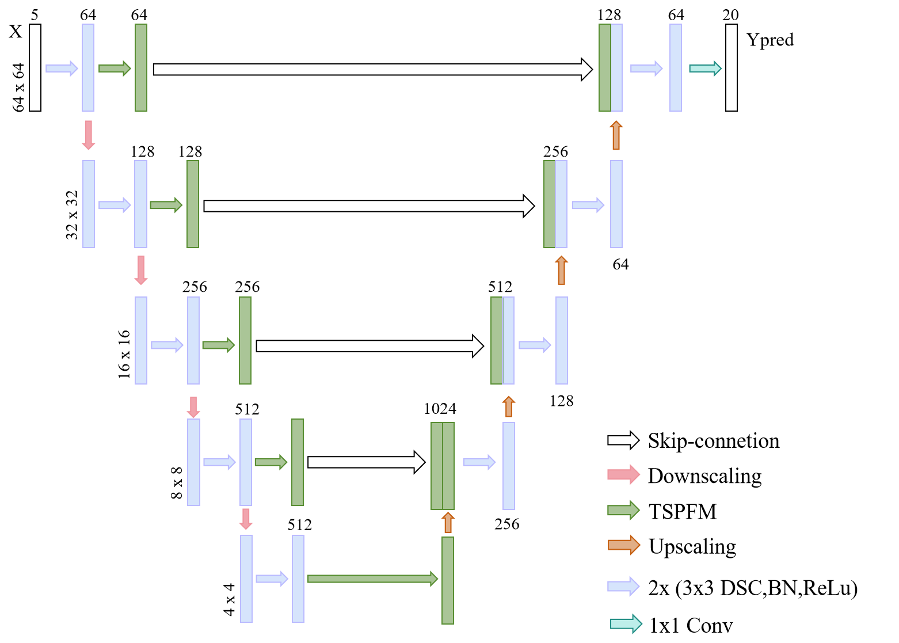
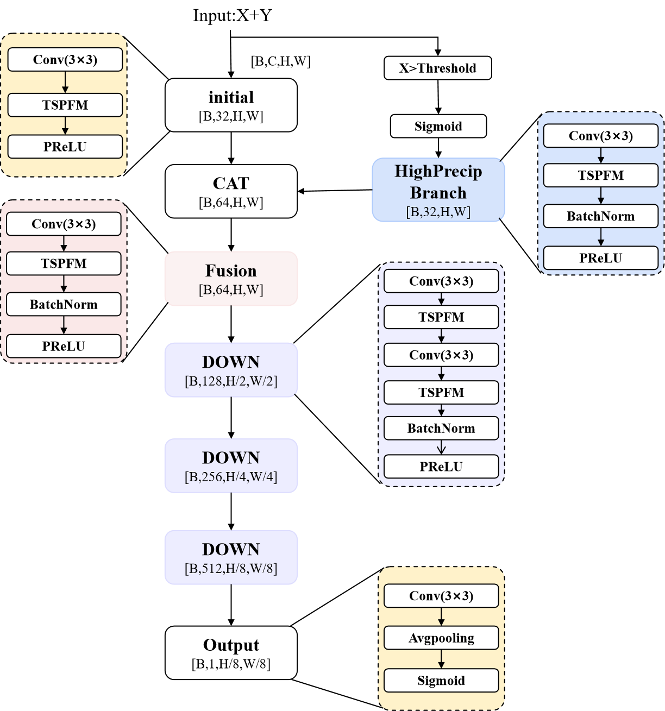
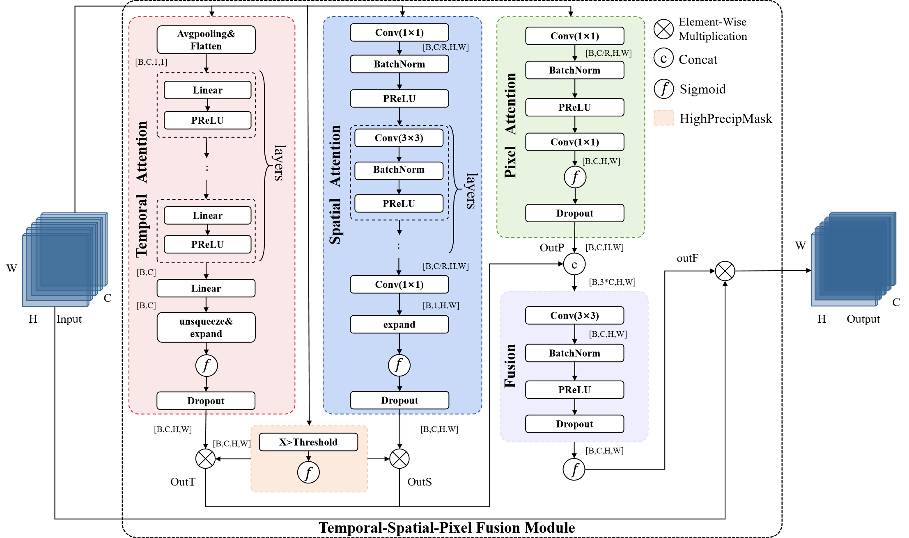

# TSPF-GAN
Code for the Paper "TSPF-GAN:a lightweight temporal-spatial-pixel feature fusion GAN for radar-based precipitation nowcasting"

The proposed TSPF-GAN's generator architecture  can be found in the model folder in [Generator.py](models/Generator.py). 
The discriminator architecture can be found in [discriminator.py](models/discriminator.py)

A [requirements.txt](requirements.txt) is also added from the poetry export.

For the paper we used [Pytorch-Lightning](https://github.com/Lightning-AI/lightning) which simplifies the training process and allows easy additions of loggers and checkpoint creations.

### Training

For training on the precipitation data the [train_precip_lightning.py](train_precip_lightning.py) file can be used. Ensure that the model to be trained is correctly specified in the model parameters of the script, and that the data file path is correctly introduced.
The training will save a checkpoint file for the top 5 best epochs in the directory specified with the `default_save_path` variable.

The [test_precip_lightning.py](test_precip_lightning.py) and [test_precip_shanghai.py](test_precip_shanghai.py) can be used to calculate the performance of the trained model on the KNMI test set or shanghai test set by providing the location of the checkpoint file with the lowest validation loss and model name in the script. The results will be saved as .csv in the specified results folder.

### Extreme Precipitation dataset

All the datasets in our research is publicly available.The KNMI dataset (2017-2022) can be found at https://dataplatform.knmi.nl/dataset/access/rad-nl21-rac-mfbs-5min-2-0. The Shanghai\_Radar dataset can be found at https://dataverse.harvard.edu/dataset.xhtml?persistentId=doi:10.7910/DVN/2GKMQJ.

We normalized the data using [Min-Max normalization](<https://en.wikipedia.org/wiki/Feature_scaling#Rescaling_(min-max_normalization)>). In order to revert this you need to multiply the images by 32.44; this results in the images showing amount of rain in mm/5min.